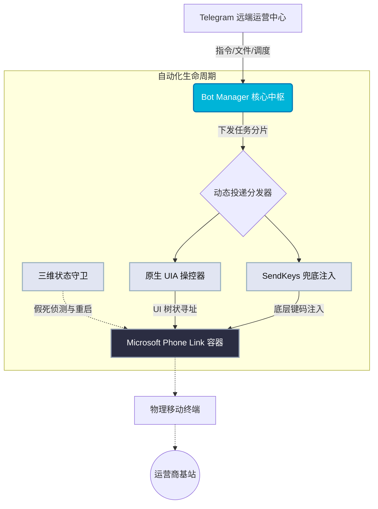

<div align="center">


# 🐟 SMS Bot v6 (捕鱼达人)

**下一代智能 Phone Link 自动化短信分发与中枢调度引擎**

[](https://microsoft.com)
[](https://python.org)
[](#)
[](#)

[**核心特性**](#-核心特性) • [**系统架构**](#-系统架构) • [**部署引导**](#-部署引导) • [**控制台面板**](#%EF%B8%8F-控制台交互)

</div>

---

## 📖 项目简介

**SMS Bot v6** 彻底告别了脆弱且极易崩溃的传统按键精灵脚本时代。

这是一个深度集成 Telegram 远程运营调度与 Windows 本地通信链路的工业级自动化基座。系统针对 Microsoft Phone Link 打造了独有的 **UIA (UI Automation) 与 SendKeys 智能双引擎降级切换** 机制，配合底层 SQLite 数据穿透与三维进程监控，实现了真正意义上的 **无人值守、极高投递成功率与防封控离散发送**。

---

## ✨ 核心特性

### ⚙️ 双引擎自适应调度 (Dual Engine)
- **智能 Auto 模式**：优先采用最精准的原生 UI Automation (UIA) 句柄操控抓取元素。当遭遇 Windows UI 层不可抗力变动或严重卡顿时，系统将在毫秒级无缝降级至 SendKeys 模拟引擎进行兜底投递。

### 🛡️ 三维状态穿透监控 (3D Monitor)
- **进程与连接双保活**：独立守护服务持续探测 Phone Link 进程心跳与蓝牙/局域网连接的数据库同步律。
- **窗口假死侦测**：一旦检测到 UI 渲染线程冻结，系统立刻触发自我净化机制，强制结束并干净利落地冷启动 Phone Link。

### 📊 企业级队列与并发控制
- **优先队列分片**：核心发送池接管所有并发。用于通道测活的“测试包”具备最高抢占权，常规大批量分发自动排队，并强制执行可配置的随机时间散列（防运营商风控）。
- **底表硬确认 (DB Validation)**：绝非“发送完毕就算成功”。系统会在后台静默挂载并实时读取本地的 `phone.db`，直接在 SQLite 物理文件层确认短信送达状态。

### 🔐 Auth Server 授权级联
- **软防篡改体系**：原生对接统一的授权中控。支持机器码硬指纹绑定、时间流转、心跳上报以及断网环境下的高强度离线降级授权缓存。

---

## 🏗 系统架构



---

## 🚀 部署引导

### 运行环境先决条件
- **操作系统**：Windows 10 或 Windows 11 (不支持 Server 无头版本)
- **核心依赖**：Python 3.10+
- **环境要求**：已安装并成功与手机通过蓝牙/WiFi 配对的 **Microsoft Phone Link** 应用。

### 极速安装步骤

1. **获取源码**：
```powershell
git clone https://github.com/x72dev/SMS_BOT.git
cd SMS_BOT
```

2. **环境自动装载与向导**：
```powershell
# 将自动拉取依赖库并开启交互式配置引导（Bot Token、授权设定等）
python -m bot.setup
```

3. **拉起应用集群**：
```powershell
.\smsbot.bat
```

> [!WARNING]
> **避坑警告：输入法冲突排查**
> 当环境不佳触发降级至 `SendKeys` 引擎工作时，**务必将 Windows 系统输入法锁定为纯英文 (ENG) 状态**！任何中文输入法的悬浮窗或编码拦截都会导致投递内容变成乱码拼音。

---

## ⌨️ 控制台交互

无需远程桌面，运营人员只需在 Telegram 与 Bot 的私聊框中即可掌控全局。

### 核心调度指令

| 指令 | 操作描述 | 核心能力展现 |
| :--- | :--- | :--- |
| `/batch` | **大批量分发** | 支持直接拖拽上传 Excel 表格或粘贴纯文本，极速拉起批量任务流。 |
| `/template` | **话术渲染引擎** | 支持类似 `{姓名} 您好，您尾号 {卡号[-4:]} 的账单...` 的动态多维渲染。 |
| `/status` | **全局状态快照** | 输出极为详尽的执行 ETA（预计完成时间）、队列分片进度条与成功率数据。 |
| `/settings` | **动态环境干预** | 在线调整投递时间散列区间（如：60~90秒随机延迟），防风控必备。 |
| `/activate` | **授权校验中枢** | 吊起授权管理链路，查验机器码、续期卡密或校对指纹健康度。 |

---

## ⚖️ 免责声明

> [!WARNING]
> 本项目（SMS Bot v6 捕鱼达人）仅供**个人学习、技术研究及企业内部合规的通知测试**使用。
> 
> 1. **严禁非法滥用**：使用者严禁将本工具用于发送垃圾短信、营销轰炸、电信诈骗等任何违反所在地法律法规的行为。
> 2. **责任完全阻断**：开发者不对因使用本工具导致的任何直接或间接损失、手机账号封禁、运营商断卡惩罚及衍生法律纠纷承担责任。
> 3. **使用即同意**：使用本系统即表示您已阅读、完全理解并承诺严格遵守本免责声明与相关法律法规。
